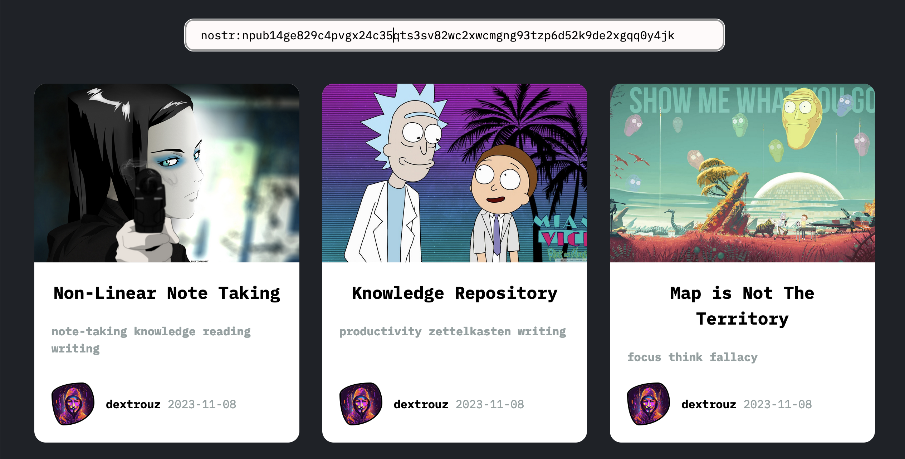

# Ixian

Overview: View [nostr](https://nostr.com/) articles using NIP-21 URI schemes.

Goal: Minimal web client to view long-form notes for your personal knowledge repository.

## Stack

- Go
- [HTMX](https://htmx.org/)
- CSS

## Setup

1. Create a new profile configuration.

```shell
mkdir -p $HOME/.config/nostr
export CONFIG_NOSTR=$HOME/.config/nostr/alice.json
touch $CONFIG_NOSTR
```

2. Install the [Ixian CLI](https://github.com/dextrouz/ixian-cli) tool to help you manage your profile from the terminal.

3. Before you can fetch notes you have to add at least one relay.

```shell
ix relay -add wss://relay.damus.io/
```

4. Run the server

```shell
make run
```

5. Navigate to [http://localhost:8081/ixian](http://localhost:8081/ixian)

## Examples


