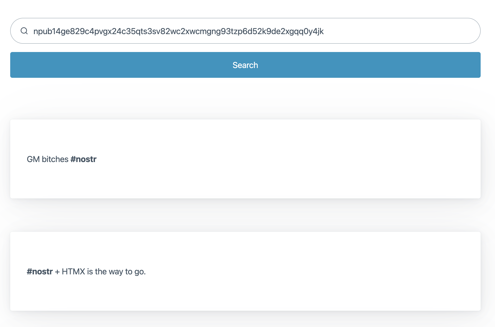

# Melange

View your [nostr](https://nostr.com/) events without the noise.

- **Goal:** Pure Minimalism
- **Stack:** Go + [HTMX](https://htmx.org/) + [PicoCSS](https://picocss.com/)



## TODO

- [ ] Public key verification
- [ ] Add event ID in smaller and greyed out text
- [X] Add list of relays to local config
- [X] POST public key to server
- [X] Pull events from relay list
- [X] Add styling to event content
- [X] Sort events to timeline view

## Setup

1. Create a new profile configuration.

```shell
mkdir -p $HOME/.config/nostr
export CONFIG_NOSTR=$HOME/.config/nostr/alice.json
touch $CONFIG_NOSTR
```

2. Install the [Ixian](https://github.com/dextrouz/ixian) CLI tool to help you manage your profile from the terminal.

3. Before you can fetch notes you have to add at least one relay.

```shell
ix relay -add wss://relay.damus.io/
```

4. Run the server

```shell
make run
```

5. Navigate to [http://localhost:8081/events](http://localhost:8081/events)
